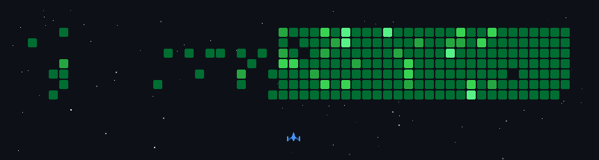

<div align="center">

<!-- PASTE THE SVG BANNER HERE OR USE TYPING SVG BELOW -->
[](https://git.io/typing-svg)

**`Security-Focused Full Stack Developer · Ethical Hacker · Building AI-Powered Security Tools · Kerala, India`**

[](https://www.linkedin.com/in/thearjunl/)
[](https://tryhackme.com/p/arjunl)
[](https://leetcode.com/u/thearjunl/)
[](mailto:theearjunl@gmail.com)


<!-- Terminal / matrix GIF — replace with your own asset in an assets/ folder for reliability -->


</div>


<p align="center">
  
</p>


```bash
$ whoami

Arjun L

🎓 Integrated MCA Graduate
🔐 Security-Focused Full Stack Developer
🛡️ Cybersecurity Enthusiast
🤖 Building AI-Powered Security Tools


```

---

## 🔐 Projects

<h3 align="center">🔐 Projects</h3>

<p align="center">

</p>

<table width="100%">
<tr>
<td width="50%" valign="top">

### 🛡️ [KAALI](https://github.com/thearjunl/KAALI)
**AI-Powered SOC Alert Correlation Engine**

`FastAPI` `Elasticsearch` `Gemini AI` `React`

Ingests real security logs (auth.log, Suricata IDS), correlates multi-stage events into incidents, maps to MITRE ATT&CK, auto-blocks critical alerts.

</td>
<td width="50%" valign="top">

### 🤖 [KUROKAMI](https://github.com/thearjunl/KUROKAMI)
**Autonomous AI Pentesting Framework**

`Python` `Ollama` `FAISS` `Docker` `K8s`

LLM dynamically selects and sequences pentest modules. FAISS RAG over CVE/MITRE ATT&CK. 70%+ test coverage, JWT auth, encrypted audit trail.

</td>
</tr>
<tr>
<td width="50%" valign="top">

### 🔥 [AirLock](https://github.com/thearjunl/AirLock)
**LLM Prompt Injection Firewall**

`Go` `Aho-Corasick` `Prometheus` `Slack`

Reverse proxy that inspects and sanitizes LLM-bound traffic in real-time. RAG payload sandboxing, rate limiting, live Slack alerts.

</td>
<td width="50%" valign="top">

### ☁️ [Ghost-Protocol](https://github.com/thearjunl/Ghost-Protocol)
**Autonomous AWS IAM Auditor**

`Python` `AWS` `Ollama` `CloudTrail` `Athena`

Discovers over-provisioned IAM identities, correlates allowed vs. actual permissions over 30 days, generates least-privilege policies — zero third-party LLM APIs.

</td>
</tr>
<tr>
<td width="50%" valign="top">

### 📊 [Argus](https://github.com/thearjunl/Argus)
**VAPT Report Automation Dashboard**

`Next.js 14` `Docker` `PostgreSQL`

Automated VAPT reporting with Gemini AI, RBAC, and ISO 27001 audit logging.

</td>
<td width="50%" valign="top">

### 🎣 [Nizhal](https://github.com/thearjunl/Nizhal)
**Phishing URL Detection Extension**

`Chrome Extension` `Random Forest ML`

Real-time phishing detection using ML-trained URL classification, built as a lightweight browser extension.

</td>
</tr>
</table>

---

## 🧰 Stack


<p align="center">
<a href="https://developer.mozilla.org/en-US/docs/Web/HTML" target="_blank"></a>
<a href="https://developer.mozilla.org/en-US/docs/Web/CSS" target="_blank"></a>
<a href="https://developer.mozilla.org/en-US/docs/Web/JavaScript" target="_blank"></a>
<a href="https://www.typescriptlang.org/" target="_blank"></a>
<a href="https://react.dev/" target="_blank"></a>
<a href="https://nextjs.org/" target="_blank"></a>
<a href="https://nodejs.org/" target="_blank"></a>
<a href="https://expressjs.com/" target="_blank"></a>
<a href="https://www.php.net/" target="_blank"></a>
<a href="https://laravel.com/" target="_blank"></a>
<a href="https://www.python.org/" target="_blank"></a>
<a href="https://www.java.com/" target="_blank"></a>
<a href="https://isocpp.org/" target="_blank"></a>
<a href="https://www.mysql.com/" target="_blank"></a>
<a href="https://www.mongodb.com/" target="_blank"></a>
<a href="https://www.postgresql.org/" target="_blank"></a>
<a href="https://supabase.com/" target="_blank"></a>
<a href="https://firebase.google.com/" target="_blank"></a>
<a href="https://redis.io/" target="_blank"></a>
<a href="https://www.docker.com/" target="_blank"></a>
<a href="https://kubernetes.io/" target="_blank"></a>
<a href="https://aws.amazon.com/" target="_blank"></a>
<a href="https://cloud.google.com/" target="_blank"></a>
<a href="https://vercel.com/" target="_blank"></a>
<a href="https://www.netlify.com/" target="_blank"></a>
<a href="https://git-scm.com/" target="_blank"></a>
<a href="https://github.com/" target="_blank"></a>
<a href="https://www.linux.org/" target="_blank"></a>
<a href="https://www.gnu.org/software/bash/" target="_blank"></a>
<a href="https://code.visualstudio.com/" target="_blank"></a>
<a href="https://www.postman.com/" target="_blank"></a>
<a href="https://tailwindcss.com/" target="_blank"></a>
<a href="https://vitejs.dev/" target="_blank"></a>
<a href="https://azure.microsoft.com/" target="_blank"></a>
<a href="https://www.terraform.io/" target="_blank"></a>
<a href="https://www.ansible.com/" target="_blank"></a>
<a href="https://nginx.org/" target="_blank"></a>
<a href="https://github.com/features/actions" target="_blank"></a>
<a href="https://www.jenkins.io/" target="_blank"></a>
<a href="https://www.kali.org/" target="_blank"></a>
<a href="https://www.wireshark.org/" target="_blank"></a>
<a href="https://owasp.org/" target="_blank"></a>
<a href="https://www.hackthebox.com/" target="_blank"></a>
<a href="https://tryhackme.com/" target="_blank"></a>
<a href="https://letsencrypt.org/" target="_blank"></a>
<a href="https://www.vaultproject.io/" target="_blank"></a>
<a href="https://openvpn.net/" target="_blank"></a>
<a href="https://www.proxmox.com/" target="_blank"></a>
<a href="https://www.cloudflare.com/" target="_blank"></a>
<a href="https://www.splunk.com/" target="_blank"></a>
<a href="https://www.elastic.co/" target="_blank"></a>

<br/>

<a href="https://nmap.org/" target="_blank"></a>
<a href="https://www.metasploit.com/" target="_blank"></a>
<a href="https://portswigger.net/burp" target="_blank"></a>
<a href="https://www.tenable.com/products/nessus" target="_blank"></a>
<a href="https://www.openwall.com/john/" target="_blank"></a>
<a href="https://github.com/vanhauser-thc/thc-hydra" target="_blank"></a>
<a href="https://www.aircrack-ng.org/" target="_blank"></a>
<a href="https://cirt.net/Nikto2" target="_blank"></a>
<a href="https://sqlmap.org/" target="_blank"></a>
<a href="https://www.zaproxy.org/" target="_blank"></a>
<a href="https://hashcat.net/hashcat/" target="_blank"></a>
<a href="https://www.maltego.com/" target="_blank"></a>
</p>

<h3 align="center">💼 Experience Timeline</h3>


- 🗓️ **Mar 2026 – Present**
  🔐 Cybersecurity Intern @ WIN in Life Academy
  → SOC monitoring, threat analysis, security ops

- 🗓️ **Earlier**
  ⚔️ Security Analyst Intern @ Red Team Hacker Academy
  → VAPT, offensive security, penetration testing

- 🗓️ **Earlier**
  💻 Software Developer Intern @ Zoople Technologies
  → React, Node.js, full-stack development

<br clear="right"/>

---
<table align="center">
<tr>
<td>

</td>
<td>

</td>
</tr>
</table>

<picture>
  <source media="(prefers-color-scheme: dark)" srcset="https://raw.githubusercontent.com/thearjunl/thearjunl/output/pacman-contribution-graph-dark.svg">
  <source media="(prefers-color-scheme: light)" srcset="https://raw.githubusercontent.com/thearjunl/thearjunl/output/pacman-contribution-graph.svg">
  
</picture>


```
[ Hunting threats. Shipping tools. Breaking things ethically. ]
```


</div>
